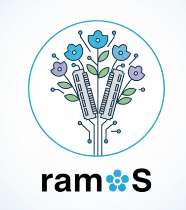

# ramOS – Educational 64-bit Operating System



ramOS is a 64-bit educational kernel based on [x64BareBones](https://github.com/alejoaquili/x64BareBones) featuring:
- Priority scheduler with aging (foreground/background processes)
- Dynamic memory manager (single free‑list allocator with coalescing & guard checks)
- Named semaphores
- Anonymous and named pipes
- A shell supporting pipelines, background execution, colored FDs, and keyboard shortcuts
- User programs and test suite

## Build & Run

Requirements:
- Docker installed and running
- QEMU installed on the host

Workflow:
1. Create container (one time):
```bash
./create.sh
```
2. Compile toolchain, Userland and Kernel:
```bash
./compile.sh
```
3. Run:
```bash
./run.sh
```
4. Clean everything manually:
```bash
docker exec -it ramOS make -C /root clean
```

Disk image used: Image/x64BareBonesImage.qcow2 (512 MB).

## Shell Built-in Commands

| Command     | Params        | Description |
| ----------- | ------------- | ----------- |
| clear       | —             | Clears screen. |
| help        | —             | Lists builtins/programs and explains pipes/background. |
| username    | <new_name>    | Changes prompt username. |

## User Programs

| Program  | Params             | Description |
| -------- | ------------------ | ----------- |
| ps       | —                  | Lists processes (PID, state, prio, PPID, FDs, stack). |
| mem      | —                  | Shows memory stats from sys_mem_info. |
| pipes    | —                  | Shows active pipes (ID, name, FDs, counts, buffered bytes). |
| time     | —                  | Prints hh:mm:ss (sys_time). |
| date     | —                  | Prints dd/mm/yy (sys_date). |
| echo     | [args...]          | Writes args to STDOUT, then EOF. |
| print    | \<string>          | prints the string to STDOUT and yields |
| red      | —                  | Copies STDIN → STDERR (pipe / FD tests). |
| rainbow  | —                  | Cycles output through colored FDs. |
| filter   | —                  | Removes vowels from STDIN until EOF. |
| wc       | —                  | Counts lines/words/chars from STDIN. |
| mvar     | \<writers> \<readers>| Shared variable demo using named semaphores. |
| kill     | \<pid...>           | Calls sys_kill on each PID. |
| block    | \<pid...>           | Calls sys_block on each PID. |
| unblock  | \<pid...>           | Calls sys_unblock on each PID. |
| nice     | \<pid> \<prio>       | Adjusts priority (0 high, 2 low). |

## Provided Tests

| Test            | Params                 | Description |
| --------------- | ---------------------- | ----------- |
| test_mm         | <max_memory>           | Alloc / write / verify / free stress + metrics. |
| test_prio       | <max_iterations>       | Shows fairness & priority impact (includes blocked). |
| test_processes  | <max_processes>        | Spawns many, kill/block/unblock randomly, uses wait for cleanup. |
| test_sync       | \<iterations> <use_sem> | Race without semaphore (0) vs synchronized (1). |
| test_pipes      | —                      | Named pipe demo (writer/reader communicating). |

## Special characters for shell

- Pipe: Single '|' per command line (left | right).
- Background: Trailing '&' runs process or pipeline detached. Adoption by init via sys_adopt_init_as_parent to avoid zombies.

## Keyboard Shortcuts

| Shortcut | Action |
| -------- | ------ |
| Ctrl+C   | Kills foreground process (and its pipe partner if linked), returns shell to foreground. |
| Ctrl+D   | Injects EOF into foreground STDIN (pipe or terminal). |
| + / -    | Increase / decrease font size in shell; redraw prompt + input. |

## Architecture Summary

- Scheduler: 3 priority queues (0 high, 1 mid, 2 low). Aging promotes long-waiting processes. Round-robin per level. nice adjusts base priority.
- Foreground control: Only foreground process reads keyboard. Foreground kill resets shell. EOF injection managed cleanly.
- Processes: sys_create_process, sys_wait, sys_exit, sys_kill, sys_block/unblock, sys_nice, sys_yield. init acts as idle and orphan adopter; resources freed deterministically.
- Pipes: Anonymous + named. Named pipe syscalls: sys_open_named_pipe, sys_close_fd, sys_pipes_info. Robust tracking of readers/writers & EOF propagation.
- Semaphores: Named API (sys_sem_open/close/wait/post) used in test_sync and mvar.
- Memory: Single free‑list allocator (first-fit, coalescing, block metadata + guard word). Exposed via sys_malloc / sys_free / sys_mem_info.
- Kernel services: RTC (sys_time/date), timer & sleep, text mode rendering (font resize), speaker tones (beep / start / stop), primitive drawing (pixels, lines, rectangles, circles, strings).

## About US

Name origin: ramOS = our initials (Rodrigo, Azul, Magali) and all data lives in RAM (no filesystem). Logo: bouquet (ramos in Spanish = bouquets).

History:
- Started as a computer architecture course project at ITBA ([link to the repo](https://github.com/rodrihern/TPE-Arqui)).
- Extended for an Operating Systems course project at ITBA ([link to the repo](https://github.com/maguiGPorzio/TP2-SO)).
- Continued for learning and experimentation.

Enjoy exploring the code.