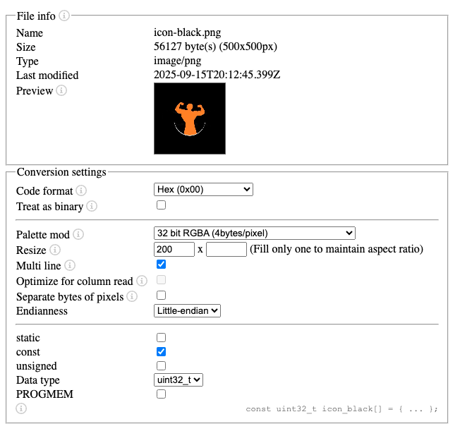

# How to Display Custom Images

This guide explains how to convert any image file into a C array that can be displayed in the operating system using the framebuffer.

## Step 1: Convert Image to C Array

1. Go to [FileToCArray converter](https://notisrac.github.io/FileToCArray/)
2. Upload your image file
3. Configure the conversion settings:
   - **Format**: Set to **32-bit RGBA**
   - **Byte order**: Little endian (default)
   - **Array name**: Choose a descriptive name (e.g., `logo_data`, `splash_image`)
   - Other options as shown in the reference image below



4. Download or copy the generated C array

## Step 2: Add to Your Project

### Create the source file (e.g., `my_image.c`)

```c
#include <stdint.h>

// Image dimensions: 64x64 pixels
const uint32_t my_image_data[] = {
    0xFFFF0000, 0xFF00FF00, 0xFF0000FF, // ... (generated array data)
    // ... rest of the image data
};
```

### Create the header file (e.g., `my_image.h`)

```c
#ifndef MY_IMAGE_H
#define MY_IMAGE_H

#include <stdint.h>

// Image dimensions
#define MY_IMAGE_WIDTH 64
#define MY_IMAGE_HEIGHT 64

// Image data array
extern const uint32_t my_image_data[];

#endif
```

## Step 3: Display the Image

Use the `fb_draw_image()` function from `framebuffer.c`:

```c
#include "framebuffer.h"
#include "my_image.h"

// Example: Draw the image at position (100, 100)
fb_draw_image(fb, my_image_data, 100, 100, MY_IMAGE_WIDTH, MY_IMAGE_HEIGHT);
```

## Important Notes

### Color Format

The generated array uses RGBA format (0xRRGGBBAA), but the framebuffer expects RGB format (0xRRGGBB). You have two options:

1. **Use `fb_draw_image()`** - This function automatically handles the conversion by shifting right 8 bits (>> 8) to remove the alpha channel.

2. **Manual conversion** - If you need to process colors manually:
   ```c
   uint32_t rgba_color = my_image_data[i];
   uint32_t rgb_color = rgba_color >> 8;  // Remove alpha channel
   ```

### Array Size

Keep in mind that images can be large:
- A 64x64 pixel image = 4,096 uint32_t values = ~16 KB
- A 256x256 pixel image = 65,536 uint32_t values = ~256 KB

Consider image size when adding to your project.

## Complete Example

Here's a complete example displaying a logo at startup:

**logo.h**
```c
#ifndef LOGO_H
#define LOGO_H

#include <stdint.h>

#define LOGO_WIDTH 48
#define LOGO_HEIGHT 48

extern const uint32_t logo_data[];

#endif
```

**logo.c**
```c
#include "logo.h"

const uint32_t logo_data[LOGO_WIDTH * LOGO_HEIGHT] = {
    // Generated from FileToCArray
    0xFFFFFFFF, 0xFFFFFFFF, 0xFFFF0000, // ... (2304 values total)
};
```

**Usage in your code**
```c
#include "framebuffer.h"
#include "logo.h"

void show_splash_screen(framebuffer_t fb) {
    // Clear screen with background color
    fb_fill(fb, 0x000000);
    
    // Center the logo on screen
    uint16_t x = (SCREEN_WIDTH - LOGO_WIDTH) / 2;
    uint16_t y = (SCREEN_HEIGHT - LOGO_HEIGHT) / 2;
    
    // Draw the logo
    fb_draw_image(fb, logo_data, x, y, LOGO_WIDTH, LOGO_HEIGHT);
    
    // Present to screen
    fb_present(fb);
}
```


